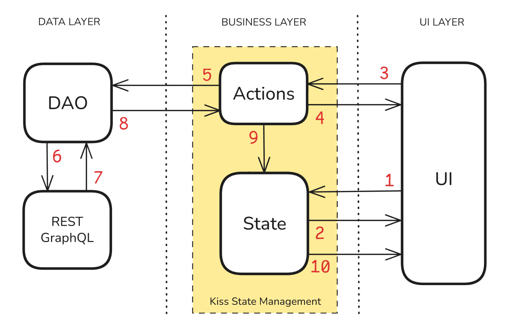

# README

This **Rick and Morty Example** is an example of a React Native application using:

* [Expo](https://expo.dev)
* [Kiss state management](https://kissforreact.org) package
* [Rick and Morty API](https://rickandmortyapi.com/) with GraphQL

View it running here: https://rick-and-morty-example.expo.app/

## Most React apps turn into a mess

Most React apps turn into a mess. Not at first. Early on they feel quick and easy. But soon every change touches too
many files, bugs slip in, and adding features feels risky. State, effects, and async logic hide everywhere. Testing
becomes so hard that many teams just give up.

Why? Because most apps grow with no clear structure. Logic mixes with UI. State lives in too many places. Side effects
are scattered. Data fetching is ad hoc. Contexts sprawl. Race conditions appear. Third-party kits leak everywhere. The
result is a tangle of invisible flows, brittle code, and features that are slow to ship.

It doesn't have to be this way.

You can design an app that stays simple, at 10 files or 10,000. An app where business logic, UI, and data layers are
separate and pluggable. Where state is centralized, predictable, and testable. Where adding a feature is obvious, and
testing it is straightforward.

This repo is about building that kind of app.

## The problems we are meant to solve here

<details>
<summary>Click here to see all the problems that were taken into consideration when architecting this app</summary>

> Fuzzy architecture. No clear modules or layers. Everything imports everything. Too much global state. Separating local
> state from server state. Prop drilling. Data passed through long chains of components, so small changes ripple.
> Overuse of context. Contexts as mutable stores make flows hidden and hard to track. Hidden side effects. Business
> logic lives in useEffect and event handlers instead of pure functions. Wrong effect deps. Missing or extra
> dependencies cause stale data, loops, or random bugs.
> Complex custom hooks. Hooks that fetch, mutate, cache, and navigate at once are hard to reason about.
> Async race conditions. Stale responses overwrite fresh state. Mixed concerns. UI, data fetching, and
> business rules sit in the same component. Re-render storms, where wide contexts or unstable props trigger whole app
> updates. Memo misuse. useMemo and useCallback used blindly, hiding real problems and adding noise.
> Ad hoc data fetching.
> Every screen fetches the same data in its own way, with no cache policy. Feature flags everywhere. Flags change flows
> at runtime and multiply code paths to test. Copy/paste patterns. Similar code forks over time and drifts out of sync.
> Weak typing or no typing. Any shaped objects and dynamic props hide contract breaks. Overly clever patterns. HOCs,
> render props, or meta abstractions stack up and confuse the flow. Styling sprawl, with many styling systems in one
> app, theme drift, and style props passed through deep trees. Routing and navigation glue. Guard logic, deep links, and
> params handled in many places. Error handling as an afterthought. Failures are swallowed or handled per screen, not
> once at the edge. Modules that manage their own state make tests and reuse hard. Heavy third party kits. Poor
> boundaries for IO. Direct calls to fetch, localStorage, AsyncStorage, or native APIs inside components.

</details>

<details>
<summary>Click here to see the **testing** problems that were taken into consideration</summary>

> Logic tied to React. Most rules live inside components or effects, not in pure functions you can import and test.
> Tight coupling. Components reach into global singletons or contexts, so you need the whole app to render one test.
> Side effects on mount. Network calls, timers, and subscriptions start as soon as a component renders.
> No seams for mocking.
> Fetch, storage, and native APIs are used directly instead of through thin adapters. Non-deterministic flows. Races,
> random IDs, and clock-based logic make tests flaky. Over deep trees. To test one branch, you must render a large tree
> with many providers and routers. Poor test hooks. No stable data, and dynamic labels make queries fragile.

</details>

## The goal of this repo

The goal of this repo is to show how to build an app that stays simple as it grows, and is easy to understand, modify,
maintain, and test. Business logic, UI, and data layers are completely separate and pluggable. State is centralized for
easy management, caching, and updates.

### Key principles:

1. Make the app easy not just at the start, but when it has thousands of files. Libraries like TanStack Query or Relay
   may feel simple at first but get harder to manage as the app grows.

2. Make the process of adding features and testing obvious. Some libraries like Redux Toolkit, MobX, and Zustand make
   parts of this clear but leave other parts complex.

At every step in designing the architecture, ask:

* Will this stay simple when the app is large?
* Is it simple for all the kinds of tasks real-world apps require?

These ideas can be applied with any state management or framework (TanStack Query, Redux Toolkit, MobX, Zustand, Relay,
etc.). But [Kiss state management](https://kissforreact.org) was built from the ground up with these principles in mind,
so it naturally supports them.

## What does the app do?

The app is a card collection for Rick and Morty characters, where users can:

* View a list of cards
* Scroll the list to load more cards (infinite scroll)
* Retry fetching cards when there is no internet connection
* View details of individual cards by tapping them
* Like or unlike cards by tapping the heart icon
* Reload the app and see that the likes are locally saved
* Toggle between light and dark themes
* Haptic feedback (vibration) for card taps and likes

## Disclaimer

This app uses the free [Rick and Morty API](https://rickandmortyapi.com/) to load images and character data. Sometimes
the API is unavailable or unstable, which can cause the app to fail to load cards. In this case, try again later.

## Installation (optional)

<details>
<summary>Click here to see instalation instructions</summary>

&nbsp;

The app can be viewed running [here](https://rick-and-morty-example.expo.app/), but if you want to run it yourself,
follow these steps:

1. Install dependencies

   ```bash
   npm install
   ```

   Note: If you encounter dependency issues, that's common with React Native projects and Expo apps when there are minor
   version mismatches between peer dependencies. In this case, try:

   ```bash
   npm install --legacy-peer-deps
   ```

2. Start the app locally (in your local machine)

   ```bash
   npx expo start
   ```

   You'll see a QR code in the output.

3. Android: Install the **Expo Go** app on your phone. It's available on the Play Store. Open the app and click "Scan QR
   Code" to scan the QR code.

4. iOS: Install the **Expo Go** app on your phone. It's available on the App Store. Then, open your device camera and
   tap the link that appears.

5. Alternatively, you can run the app in an Android emulator or iOS simulator, or create a development build. More
   information:

    * [Expo Go](https://expo.dev/go)
    * [Android emulator](https://docs.expo.dev/workflow/android-studio-emulator/)
    * [iOS simulator](https://docs.expo.dev/workflow/ios-simulator/)
    * [development build](https://docs.expo.dev/develop/development-builds/introduction/)

6. Alternatively, you can run the app locally for the web only, with:

   ```bash
   npx expo start --web
   ```     

Note: _During development, when you edit the app files, it should reload automatically, both in the Expo Go app or web
browser. Under WSL (Windows Subsystem for Linux), the auto-reload may not work. If that happens, start the web
server (`npx expo start`) in the regular Windows terminal instead of WSL._

### Publishing the app to the web

The app uses React Native for web (RNW), which is a set of component libraries such as `<View>`, and `<Text>`, that wrap
react-dom primitives such as `<div>`, `<p>`, and ``. This means this app can run both on mobile devices and in a
web browser._

You can see the app running [here](https://rick-and-morty-example.expo.app/).
This deployment was done with Expo's free EAS hosting service, following these steps:

1. Create an Expo account at https://expo.dev/signup
2. In the terminal: `npm install --global eas-cli`
3. In the terminal: `eas login` and use your Expo account username and password
4. In the terminal: `npx expo export --platform web`
5. In the terminal: `eas deploy`
6. Agree to connect an EAS project (if you haven't done so yet)
7. Choose a preview subdomain name (in our case, `rick-and-morty-example` was chosen)
8. Test the deployment by opening the provided preview URL
9. If everything looks good, you can publish the app with `eas deploy --prod`
10. The app will be available at: https://rick-and-morty-example.expo.app

If you change the app and want to publish a new version, run:

1. In the terminal: `npx expo export --platform web`
2. In the terminal: `eas deploy` or `eas deploy --prod`
3. Go to https://rick-and-morty-example.expo.app and reload.

Note, the app is published as a single-page application (SPA), as set by the `app.json` file:

```json
{
  "expo": {
    "web": {
      "output": "single"
    }
  }
}
```

For more information, see: https://docs.expo.dev/eas/hosting/get-started

### Initial template

The app was initially created with [`create-expo-app`](https://www.npmjs.com/package/create-expo-app),
which sets up the basic template of a Expo app with TypeScript support. The following line was then added
to the `package.json` file:

```json
{
  "dependencies": {
    "kiss-for-react": "^1.0.3"
  }
}
```

</details>

&nbsp;

# The App Architecture

The app uses the [Kiss state management](https://kissforreact.org) package to manage the app state and actions. Kiss is
a complete but easy-to-use state management library for React and React Native that provides a simple way to manage
application state with immutable objects and actions, similar to Redux, but much easier to use.

## The information flow

Here are the layers and how information flows in the app:



1. When the app opens, React renders the UI. The UI asks the **"store"** for the pieces of **"state"** it needs to
   render.

2. The store sends the requested state to the UI synchronously. The UI renders using that data.

3. Whenever the user interacts with the UI, it dispatches **"actions"**, which represent desired changes in the app
   state. Dispatching an action is the only way to change the state.

4. While the action is running, it notifies the UI so the UI can show a progress indicator.

5. The running action has access to the action parameters, the full app state, and any information loaded from external
   services. Loading data from the server is done through a pattern called DAO (Data Access Object).

6. The DAO talks to external services over HTTP. It can call REST endpoints or send GraphQL queries, but those details
   are hidden inside the DAO.

7. Inside the DAO, the external service replies. The DAO parses and maps the response into app state models that the
   app can use directly.

8. The DAO returns the result to the action.

9. The action completes by producing a new, modified app state. This becomes the new app state.

10. All parts of the UI that depend on the modified state rebuild automatically, showing the updated data.

&nbsp;

### In more detail

Since the above explanation may feel a bit abstract, let's review it again in more detail and concrete code examples:


1. When the app opens, React renders the UI. The UI is made of React components that use selectors
   (`useSelect` hook) to ask the **store** for the parts of the **state** they need to render.
   Example: the `isCardLiked` selector tells the app if a card with a given id is liked or not:
   ```typescript
   const isLiked = useSelect((state: State) => state.likedCards.isCardLiked(id));
   ```   
   This selector is in `app/card/[id]/index.tsx`.

2. When prompted by a selector, the store sends the requested state to the UI synchronously. Components render using
   that state. For example, the component may use the `isLiked` boolean to render the heart icon as a gray outline or
   solid red.

3. Suppose the user interacts with the UI in a way that requires new data from the server. Components then dispatch
   actions (`useDispatch` hook) that are named to reflect the desired change in state. Dispatching an action is the only
   way to change state.
   Example: the `FetchCards` action (in `app/business/actions/fetch-cards-action.ts`) can be dispatched in three cases:
    * Automatically when the main app component mounts (`app/index.tsx`), to load the initial cards.
    * For pagination, when the user scrolls to the end of the list (`app/index.tsx`).
    * By the Retry Button (`app/components/ParallaxScrollView.tsx`). Example:
   ```tsx
   <Button
     title="Retry"
     onPress={() => dispatch(new FetchCards())}
   />
   ```

4. The UI can ask to be notified when an action is running, by using the `useIsWaiting` hook. It can then show a
   progress indicator. Example, the `isLoading` selector in `app/index.tsx`:
   ```typescript
   const isLoading = useIsWaiting(FetchCards);    
   ``` 

5. A running action can use three types of information:
    * Parameters passed from the UI (in the `dispatch` call itself).
    * The entire app state, which is directly accessible in the action as `this.state`.
    * Data loaded from the server, local device, or third-party services.
      The recommended way to load server data is through a DAO (Data Access Object). A DAO contains all the logic for
      REST or GraphQL calls, hiding those details from the app. It exposes a clean interface to the business layer.
      Example from the `FetchCards` action (`app/business/actions/fetch-cards-action.ts`):
   ```typescript
   const { cards, totalCount, totalPages } = await DAO.loadCards({ page: nextPage });
   ``` 

6. The DAO talks to external services over HTTP. It can use REST or GraphQL, but the app only sees the DAO contract:
   ```typescript
   export abstract class Dao {
     abstract loadCards({ page }: { page: number }): Promise<{ cards: CardList, totalCount: number, totalPages: number }>;
   }
   ```

7. Inside the DAO, the external service replies. The DAO parses and maps the response into app state models that the app
   can use directly. For example, the implementation fetches data from the Rick and Morty API using GraphQL, in
   `business/dao/real-dao.ts`.

8. The DAO returns the result to the action.

9. The action completes by returning a new, modified app state. This becomes the new app state.

10. All parts of the UI that use the modified state rebuild automatically, showing the updated data.

&nbsp;

### Separation of concerns

Finally, let's see the diagram again, but this time use it to find out why this architecture makes it easy for both
humans and AI to understand and modify the app:


* **To the right of the diagram you can see the UI Layer.**
  It doesn't need to know about any business rules, about the server, the device, or 3rd-party services.
  It is completely isolated from those. All it can do is:
    - Arrow 1: Request parts of the state
    - Arrow 2: Receive the requested parts of the state
    - Arrow 3: Dispatch actions
    - Arrow 4: Get informed about actions that are running or that failed
    - Arrow 10: Get notified of state changes, so that it rebuilds

* **In the middle of the diagram you can see the BUSINESS Layer.**
  It doesn't need to know about how the UI is build, about the server, the device, or 3rd-party
  services. It is completely isolated from those. All it can do is:
    - Arrow 1: Receive requests from the UI, to send it parts of the state
    - Arrow 2: Respond with the requested parts of the state
    - Arrow 3: Run dispatched actions
    - Arrow 4: Inform the UI about actions that are running or that failed
    - Arrows 5 and 8: Ask and receive data from the DAO (load from server, device, or 3rd-party services)
    - Arrow 9: Create a new, modified copy of the state, which becomes the new app state
    - Arrow 10: Notify the UI that the state changed (automatically)

* **To the left of the diagram you can see the DATA Layer.**
  It doesn't need to know about how the UI is build, and it doesn't need to know about business rules.
  It is completely isolated from those. All it can do is:
    - Arrows 5 and 8: Receive a data request and reply to it
    - Arrows 6 and 7: Contact the server and load from it

## The directories

The app has the following directory structure:

* State management in `business/state` with immutable state
* Kiss actions in `business/actions`
* GraphQL encapsulated in DAO (Data Access Object) in `business/dao`
* UI components in `components`
* Custom hooks in `hooks`
* App screens in `app` using Expo Router's file-based routing
* Tests and mocks in the `__tests__` and `__mocks__` directories

## The State

In `state.js` the app state is defined as an immutable object of type `State`, which includes:

```typescript
cardList: CardList; // List of cards of type `Card`
selectedCardId: string | null; // Card we selected to view details
totalCount: number; // Total number of cards
totalPages: number; // Total number of pages of 20 cards each
likedCards: LikedCards; // List of liked card IDs  
colorScheme: 'light' | 'dark' | null;
```

The `State` object knows how to modify itself. We call its methods to generate modified copies of the state. We don't
need to access its internal details directly to make modifications. By calling its methods, we obtain a new state object
reflecting the desired changes. This approach simplifies modifying, reasoning about, and testing the state.

Note that `cardList` and `likedCards`, part of the State, are also immutable objects with their own modification
methods. This creates a recursive pattern, where each object knows how to modify itself, allowing us to easily generate
updated copies of the entire state.

## Actions

In Kiss, the so-called **actions** are dispatched to modify the state. These actions have access to the entire app state
as an immutable snapshot. Each action includes a `reduce` method, which returns a new, modified copy of the state. This
modified copy then becomes the new app state.

This approach centralizes the state management logic, making it easier to reason about state changes. For example, here
is the action to toggle the like status of a card:

```typescript
export class ToggleLike extends Action {

  // Card ID to toggle
  constructor(public cardId: string) { super(); }

  reduce() {
    // Toggle the card in likedCards
    let newLikedCards
      = this.state.likedCards.toggleCard(this.cardId);

    // Return a new state with updated liked cards
    return this.state.withLikedCards(newLikedCards);
  }
}
```

Let's look at a more complex action:

### Fetching cards

Cards are fetched by dispatching the `FetchCards` action. The initial part of its code looks like this:

```typescript
export class FetchCards extends Action {

  nonReentrant = true;
  retry = {on: true}
  checkInternet = {dialog: true}
```

This configuration specifies:

* `nonReentrant = true;` prevents multiple fetches from happening simultaneously.

* `retry = { on: true }` means the action will retry a few times if it fails, helpful for temporary network issues.

* `checkInternet = { dialog: true }` ensures the app checks internet connectivity before executing the fetch. If there
  is no connection, it gracefully handles airplane mode by showing a dialog to the user with the message:
  `"There is no Internet. Please verify your connection"`.

Next is the reducer logic:

```typescript
let nextPage = this.state.nextPage();
if (nextPage == null) return null;        
```

The `nextPage` method determines whether more pages need to be loaded. If no more pages are available, returning `null`
ends the action early and cancels the fetch.

```typescript
const {cards, totalCount, totalPages}
  = await DAO.loadCards({page: nextPage});
```

We now fetch the cards with the `DAO.loadCards()` method.

The DAO (Data Access Object) encapsulates server communication, isolating this logic from the rest of the app. In other
words, the rest of the app doesn't know or care about how information is loaded. Currently, the DAO uses GraphQL, but it
could use REST or another method without affecting the rest of the application.

This also means the DAO can be simulated during both development and in tests, so we can develop and test the app
without needing to connect to the server. This is actually being done in this app, as we'll see later.

Finally, the reducer finishes by updating the state:

```typescript
// Add the newly fetched cards to the existing list.
let allCards = this.state.cardList.addCards(cards);

// Return updated state with the new card list and updated totals.
return (state: State) =>
  this.state.copy({
    cardList: allCards,
    totalCount: totalCount,
    totalPages: totalPages
  });        
```

## Checking Internet Connection

The `FetchCards` action checks if the device is connected to the internet before running. If there is no connection, it
displays a dialog with the message "There is no Internet. Please verify your connection." Additionally, a "Retry" button
appears at the end of the card list, allowing the user to retry fetching cards when back online.

This is implemented by setting the `checkInternet = { dialog: true }` property on the action. To avoid showing the
dialog, set `checkInternet = { dialog: false }` instead. In this case, the "Retry" button will still appear, but no
dialog will be shown.

Other actions that require checking internet connectivity can similarly use the `checkInternet` property. This
centralizes internet connectivity logic in one place.

### How is it implemented?

The `before()` method of the default Kiss `Action` class (defined in file `action.ts`) runs before each action. It
checks if the action includes the `checkInternet` property and uses the `NetInfo` library to verify connectivity. If no
internet is available, it throws a `UserException` (optionally showing a dialog), which prevents the reducer from
executing and avoids unnecessary network requests.

Note: `UserException` is provided by Kiss, and the app was set up to automatically show a dialog with an error message
when this exception is thrown.

```typescript
export const userExceptionDialog: ShowUserException =
  (exception, count, next) => {
    // Use browser's alert on web, and React Native's Alert on mobile.
  ...
  };

const store = createStore<State>({
  initialState: State.initialState,
  showUserException: userExceptionDialog,
});
```

Since DAO methods (that load information with GraphQL) are always called within actions, DAOs can also simply throw a
`UserException` to show error dialogs to the user.

### Retry button

The `FetchCards` action might fail due to various reasons such as no internet connection, network errors, or server
errors.

In the scroll-view component that contains the cards, we check if the `FetchCards` action failed by using:

```typescript
const isFetchCardsFailed = useIsFailed(FetchCards);
```

If `isFetchCardsFailed` is true, we display a "Retry" button at the end of the card list. Pressing this button simply
dispatches the `FetchCards` action again, automatically removing the "Retry" button and checking internet connectivity
again.

## DAO

The DAO (Data Access Object) is a pattern that encapsulates all the code that loads information from the server. It is
implemented in the `business/dao` directory, and is used to load the cards from the server.

GraphQL isn't used anywhere else in the app. The app must ask the DAO to load or save data.

**IMPORTANT:** The DAO methods return immutable objects that are already in their ideal format for being used by the
app. The DAO never "leaks" the JSON format of the GraphQL. This uncouples the app from the GraphQL implementation, and
allows the server API to evolve independently and with minimal impact on the app.

### Simulating the DAO

Since the DAO completely encapsulates server communications, it can be **simulated** during development, and also when
running tests. This allows us to develop and test the app without real server connectivity.

To see how this may help during development, open file `app/_layout.tsx` and uncomment the following line:

```typescript
setDao(new SimulatedDao());
```

This replaces the real DAO with a simulated one providing fake data. The app will then have only 25 fake cards in 2
pages.

This is very helpful for development, as it allows us to create app features that need information that's not yet
available in the server API. This uncouples the app development from the server development.

Additionally, file `fetch-cards-action.test.ts`, which tests the `FetchCards` action, uses the simulated DAO to test the
action without needing to connect to the server. By changing a flag, tests can also run against the real DAO when
available.

## Card list

When the UI detects the user has scrolled to the end of the card list, it dispatches the `FetchCards` action again,
implementing infinite scrolling.

We use Kiss's hooks:

* `const isLoading = useIsWaiting(FetchCards);` to show a "Loading Cards..." message when cards are being fetched.

* `const isFetchCardsFailed = useIsFailed(FetchCards);` to show a "Retry" button if the fetch fails.

As you can see, we get all this functionality of the card list almost for free, with very little code, just by using the
state management system itself to monitor that the action is running or has failed.

## Saving likes

Likes are saved locally on the device. When reloading the app, liked cards remain liked. This functionality leverages
Kiss's "persistor" feature, which saves the required parts of the state:

```typescript
async persistDifference(_lastPersistedState: State | null, newState: State) {

  // Get liked cards from the new state
  let likedCards = newState.likedCards;

  // Serialize likedCards to a string
  const serialized = JSON.stringify(likedCards.ids);

  // Save the serialized string to AsyncStorage
  await AsyncStorage.setItem('state', serialized);
}
```

On app startup, liked cards are read automatically:

```typescript
async readState(): Promise < State | null > {

  // Read serialized JSON string
  let serialized = await AsyncStorage.getItem('state');
  if (serialized === null) return null;
    
  // Deserialize JSON to a list of integers.
  let likedCardIds = JSON.parse(serialized);
    
  // Create a new LikedCards instance with the card IDs
  let likedCards = new LikedCards(likedCardIds);
    
  // Return a new state with the liked cards
  return State.initialState.copy({likedCards: likedCards});
}
```

## Testing

Run the tests with:

```bash
npm run test
```

Alternatively, install the Jest extension for VSCode (by Orta) and run the tests by clicking the "Play" icon in the test
files. View results in the "TEST RESULTS" tab in the bottom panel of VSCode.

By keeping the UI layer as thin as possible and keeping all the business logic in the business logic layer, the app
becomes easy to test. Most variations can be tested at the business logic layer, and only basic UI rendering needs to be
tested at the UI layer.

### How to test state objects

State objects are immutable and have their own methods to modify themselves. These methods are "pure," meaning they
don't produce side effects. This makes them extremely easy to test: We can simply create a new object with modified
values by calling these methods, and then compare the result to the expected object. For an example, see file
`state-next-page.test.ts`.

### How to test actions

Tests for Kiss actions generally follow this pattern:

1. Set up the store with an initial state
2. Dispatch one or more actions
3. Wait for the actions to complete
4. Verify the new state

Check files like `fetch-cards-action.test.ts` for examples of tests following this pattern.

I also like to use the BDD (Behavior-Driven Development) format for test descriptions. This means structuring test
descriptions to clearly outline the initial context, the action performed, and the expected outcome. This makes it
easier to understand what the test is doing and why. The BDD pattern looks like this:

```text
Given [initial context/state].
When [action is performed].
And [additional context if needed].
But [exception to the rule if needed].
Then [expected outcome].
```

## Directory structure

I like using a clean architecture pattern, dividing the app into layers. The UI layer (React components) is separated
from the business logic layer (Kiss state and actions), which is separated from the data access layer (the DAO).

The current directory structure fits this simple example app well. For a more complex real-world app, I usually prefer
organizing files by feature rather than by type. This means all files related to a specific feature are kept in the same
directory instead of separated by type. Today, with advanced IDEs like VSCode or IntelliJ, directory structure isn't as
important as before, since navigation is often automated. Still, maintaining a clear directory structure helps
developers better understand the app by keeping all related files together.

## My Architecture and State Management philosophy

This app needs surprisingly few lines of code to implement complex features like infinite scroll, loading information,
retrying failed actions, displaying loading spinners and error indicators, and persisting state. Additionally, the code
implementing these features is very easy to read, understand, and modify.

The essence of great software design often boils down to two fundamental principles: making things easy and keeping
things simple. At first glance, "easy" and "simple" might appear similar, but there'ss a crucial distinction.

When something is **easy**, it often means minimal code is required to accomplish complex tasks. Frameworks and
libraries can offer powerful abstractions that make difficult operations straightforward. Consider Expo's routing
mechanism used in this example app: It's remarkably easy to use, and takes very little code to implement because Expo
makes numerous assumptions and configurations behind the scenes. This easiness can feel like magic to developers. But
this magic has a downside: because the underlying mechanisms aren't always clear, understanding exactly how and why
things work can become challenging when issues arise or when customization is needed.

On the other hand, **simplicity** emphasizes clarity and transparency. A simple system is one whose workings and
intentions are immediately obvious to the developer. It doesn't hide too much behind abstractions. The design clearly
reveals the "why" and "how," making the code inherently self-explanatory and straightforward. Simple solutions feel
natural and intuitive rather than magical. Developers using simple solutions understand precisely what's happening under
the hood, making maintenance, debugging, and enhancements far easier.

Ideally, we should aim to blend both traits. In my own Kiss State Management package that I use in this app, I took
ideas from Redux, MobX, TanStack Query, Zustand and others, to make it easy, and also added some extra features to make
it simple, like the ability to handle async actions, persist the state, check if an action is dispatching (to show
spinners), has failed (to show error messages), automatic retries, and a lot more. However, it deliberately avoids
magical abstractions by clearly communicating its internal operations. This ensures that developers aren't left guessing
how things work.

## final notes

### More ideas

The following features were not implemented in this app but could be added in the future:

* **Using Mutations:** Implement a GraphQL mutation to allow users to "like" or "unlike" a card, persisting the state
  through the API. To do this, create a DAO method called `saveLikes` that uses a GraphQL mutation to save likes on the
  server. Then, call `await DAO.saveLikes()` from the `ToggleLike` action. This will allow the app to persist likes on
  the server rather than just on the local device. When the app starts, it can dispatch a `LoadLikes` action that uses
  the method `let likes = await DAO.loadLikes()` to load likes from the server. This ensures the app syncs likes between
  the device and the server.

* **Camera Handling (Images, QR Codes, etc.):** Integrate basic camera functionality so that users can capture a photo
  or scan a QR code.

* **UI tests:** Due to layer separation, the UI has very little logic requiring testing. However, it's still important
  to test key parts of the UI layer, not only the business logic layer. Testing UI components in React typically
  involves verifying that components render correctly with expected content and structure, respond properly to user
  interactions, and reflect the correct state of the app.

### In case of problems with Expo

If you encounter issues with Expo, try the following commands to clear the cache and fix dependencies:

Try:

```bash
npx expo start --clear
npx expo install --fix
npx expo-doctor 
```
